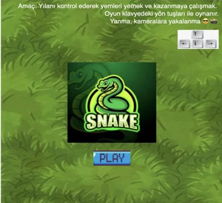
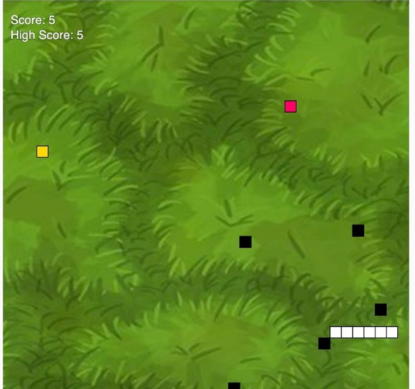
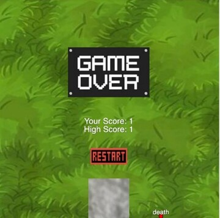

# 🐍 SnakeGame

Bu proje, klasik **Yılan Oyunu**'nun JavaScript (p5.js) kütüphanesiyle modernleştirilmiş bir versiyonudur. Oyuncu, yılanı kontrol ederek yemleri toplamaya ve puan kazanmaya çalışır. Özgün yanı: yandığında kameraya yakalanırsın! 😎🎥

---

## 🎮 Oyun Hakkında

- Klavye yön tuşları ile oynanır.
- Oyuna “Play” butonuna tıklayarak başlanır.
- Yılan, yemleri yedikçe büyür ve hızı artar.
- Altın yemler belirli süreyle çıkar, fazladan puan kazandırır.
- Kendine, sınır duvarlarına veya çukurlara çarparsan oyun biter.
- Skorun 50’ye ulaşırsa oyunu kazanırsın!

### 📸 Yenilikçi Özellik

- Oyuncu yandığında **kamera kaydı alınır** ve ölüm konumu işaretlenir.  
  Oyuna eğlenceli ve sürprizli bir deneyim katar. 😄

---

## 🧠 Oynanıştan Görseller

### Ana Menü  

### Oyun İçi  

### Game Over Ekranı  

---

## 🧩 Kod Yapısı

- `index.html` → Ana HTML dosyası  
- `style.css` → Arayüz stilleri  
- `sketch.js` → Oyun döngüsü ve genel işleyiş  
- `Snake.js` → Yılanın davranışları (hareket, çarpışma, büyüme)  
- `Flame.js` → Yandığında çıkan efektler  
- `p5.js` ve `p5.sound.min.js` → Kütüphane dosyaları  
- `ses/` klasörü → Oyun müzikleri ve efekt sesleri  
- `amac.txt` → Oyunun kısa açıklaması

---

---

## 📜 Lisans

Bu proje, eğitim amaçlı geliştirilmiştir. Kodlar açık kaynaklıdır ve geliştirilmeye açıktır.
